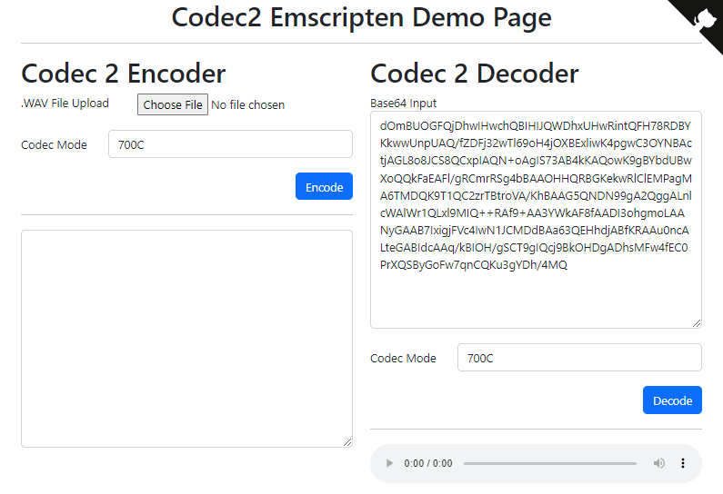

# Codec 2 Emscripten

Codec 2 (https://github.com/drowe67/codec2) is a digital speech codec designed to operate as low as 450 bits/s. This repo compiles it using Emscripten for use in the browser.

Check out the demo: https://rameshvarun.github.io/codec2-emscripten/

